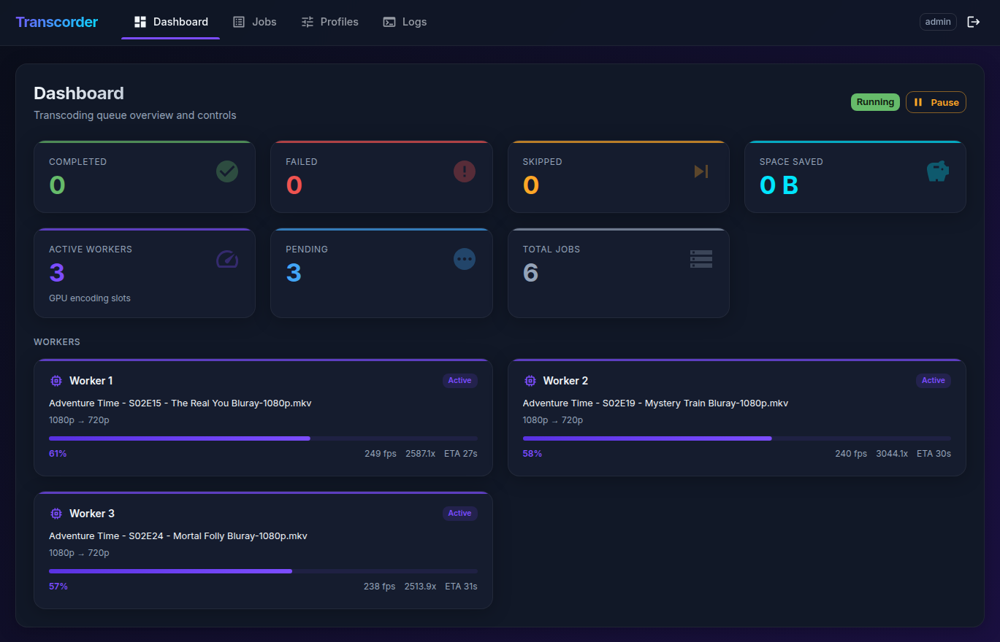

<div align="center">

# TranscoRder

**Drop-in video transcoding daemon that quietly shrinks your media library while you sleep.**

GPU-accelerated batch transcoding powered by NVIDIA NVENC — with a real-time web dashboard, profile-based configuration, and a priority job queue. A modern, self-hosted alternative to Tdarr.

[](LICENSE)
[](https://nodejs.org)
[](https://www.typescriptlang.org)

<br />



<br />

*Real-time dashboard showing parallel GPU workers transcoding a media library.*

</div>

---

## Why TranscoRder?

You have terabytes of media files bloated with oversized encodes, unnecessary HDR, or resolutions your setup will never display. You want them smaller — without babysitting each one.

TranscoRder points at your media folders, scans them, and re-encodes everything that doesn't meet your criteria. It runs as a daemon, watches for new files, and handles the rest. When it's done, your library is leaner and your storage breathes again.

- **Set it and forget it** — runs 24/7, watches for new files, never crashes on a single bad file
- **Blazing fast** — NVIDIA NVENC hardware encoding with multi-worker parallelism
- **Smart about it** — skips files that are already small enough, preserves aspect ratios, handles 10-bit and HDR
- **Full visibility** — real-time web UI, live log streaming, job history, and persistent stats across restarts

---

## Features

| | |
|---|---|
| **GPU Encoding** | NVIDIA NVENC with configurable presets (p1–p7) and constant quality control |
| **Multi-Worker Queue** | Configurable parallel workers with priority scheduling |
| **Web Dashboard** | React 19 + MUI v6 SPA — stats, workers, jobs, profiles, and live logs |
| **Profile System** | Separate configs for movies, series, anime — different rules, different quality targets |
| **HDR → SDR** | Automatic tone mapping with zscale when configured |
| **Smart Skipping** | Minimum size reduction enforcement, duplicate detection, resolution-aware analysis |
| **Persistent History** | SQLite-backed job tracking — completed, failed, skipped records survive restarts |
| **File Watching** | Daemon mode with chokidar — new files are automatically detected and queued |
| **Pause / Resume** | Press `p` in the terminal or click the button in the web UI |
| **Filename Cleanup** | Strips release tags, adds resolution tags (`Movie Title-1080p.mkv`) |
| **Live Logs** | Real-time SSE log streaming to the web UI — see exactly what the daemon sees |
| **Cache Management** | Automatic cleanup on startup, shutdown, and after failures |

---

## Quick Start

```bash
# Clone
git clone https://github.com/Linkek/TranscoRder-cli && cd transcorder

# One-command setup (installs deps, builds web UI, creates config)
./setup.sh

# Edit your config
nano config/profiles.json    # Set your source folders and preferences

# Launch
npm run daemon
```

Open **http://localhost:9800** to see the dashboard.

> You can also run `npm run setup` instead of `./setup.sh`. See [docs/INSTALLATION.md](docs/INSTALLATION.md) for detailed instructions.

---

## Requirements

| | |
|---|---|
| **Node.js** | v24+ |
| **FFmpeg** | v5+ built with NVENC support |
| **NVIDIA GPU** | GTX 1660 / RTX 2060 or better |
| **Drivers** | NVIDIA 525+ with CUDA support |
| **OS** | Linux (tested on Ubuntu/Debian) |

```bash
# Verify NVENC is available
ffmpeg -encoders 2>/dev/null | grep nvenc
```

---

## Configuration

Everything lives in `config/profiles.json`:

### Global Settings

```jsonc
{
  "global": {
    "workers": 2,              // Parallel GPU encoding slots
    "webui": true,             // Enable the web dashboard
    "webuiPort": 9800,
    "webuiUsername": "admin",
    "webuiPassword": "change-me",
    "localAllow": true,        // Skip login from localhost
    "pauseOnStartup": false    // Start paused for manual review
  }
}
```

### Profiles

Each profile targets a media type with its own rules:

```jsonc
{
  "profiles": [
    {
      "name": "series",
      "sourceFolders": ["/mnt/nas/Media/Series/"],
      "recursive": true,
      "replaceFile": true,       // Overwrite originals (back up first!)
      "outputFormat": "mkv",
      "cacheFolder": "cache",
      "maxWidth": 1280,          // Downscale to 720p
      "maxHeight": 720,
      "downscaleToMax": true,
      "renameFiles": true,       // Clean up filenames
      "removeHDR": true,         // Tone map HDR → SDR
      "nvencPreset": "p4",       // Quality/speed balance
      "cqValue": 23,             // Constant quality (lower = better)
      "log": false,
      "priority": 10,            // Higher = processed first
      "minSizeReduction": 2      // Skip if < 2% smaller
    },
    {
      "name": "movies",
      "sourceFolders": ["/mnt/nas/Media/Movies/"],
      "maxWidth": 1920,          // Keep at 1080p
      "maxHeight": 1080,
      "cqValue": 21,             // Higher quality for movies
      "priority": 5
      // ... other options
    }
  ]
}
```

> See [docs/CONFIGURATION.md](docs/CONFIGURATION.md) for the full options reference, NVENC preset guide, and CQ tuning tips.

---

## Usage

### Daemon Mode

```bash
npm run daemon                # Start watching and processing
npm run daemon -- --verbose   # With debug logging
```

| Key | Action |
|---|---|
| `p` | Pause / resume the queue |
| `Ctrl+C` | Graceful shutdown |

### CLI Commands

```bash
npm start                     # Interactive menu
npm run scan                  # One-shot scan (no watching)
npm run audit                 # Audit previously transcoded files
```

### Build & Test

```bash
npm run build                 # Build CLI + web UI
npm run test:run              # Unit tests
npm run test:all              # All tests (including integration)
```

---

## Web UI

Enable with `"webui": true` in your config, then visit **http://localhost:9800**.

| Tab | What it shows |
|---|---|
| **Dashboard** | Live stats, active workers with progress bars, pause/resume controls |
| **Jobs** | Full job history — filter by completed, failed, skipped, pending |
| **Profiles** | Overview of all configured transcoding profiles |
| **Logs** | Real-time streaming log view — like watching the terminal, from anywhere |

Authentication is session-based. Localhost can bypass login when `localAllow` is enabled.

> See [docs/WEBUI.md](docs/WEBUI.md) for the API reference.

---

## Architecture

```
src/
  cli.ts                    Entry point & command routing
  commands/                 daemon, scan, audit, config, diagnostics
  lib/
    queue.ts                Multi-worker job queue with priority scheduling
    transcode.ts            FFmpeg/NVENC transcoding pipeline
    db.ts                   SQLite persistence (WAL mode)
    webui.ts                Express 5 API + static serving
    watcher.ts              Filesystem watching (chokidar)
    check.ts                Pre-transcode analysis
    dashboard.ts            Terminal UI (workers, progress bars)
    logger.ts               Structured logging with web UI streaming
  types/                    TypeScript interfaces

web/                        React 19 SPA (Vite 6 + MUI v6)
config/                     profiles.json
tests/                      Vitest 4 (unit + integration)
```

---

## Tips

- **Back up your media** before enabling `replaceFile: true`
- Use a fast **SSD** for the `cache` folder — transcoding writes heavily
- Set `minSizeReduction` to **2–5%** to skip files that barely shrink
- **p4** preset is the sweet spot for quality vs. speed; use **p7** if you want maximum quality and don't mind waiting
- Tune `cqValue` per content type: **20–22** for movies, **23–26** for series
- Use **higher priority** numbers for profiles you want processed first

---

## Troubleshooting

| Problem | Fix |
|---|---|
| `ffmpeg: not found` | Install FFmpeg with NVENC support and add to `PATH` |
| NVENC encoder errors | Update NVIDIA drivers; verify with `nvidia-smi` |
| Permission denied | Check read/write access to source, cache, and data directories |
| Web UI blank page | Run `npm run build:web` to build the frontend |
| Port 9800 in use | Change `webuiPort` in config or run `npm run kill` |
| Jobs missing after restart | Fixed in v1.3 — job history now persists across restarts |

---

## Contributing

See [CONTRIBUTING.md](CONTRIBUTING.md) for development setup and code style guidelines.

## License

[MIT](LICENSE) — Copyright 2026 Linkek
